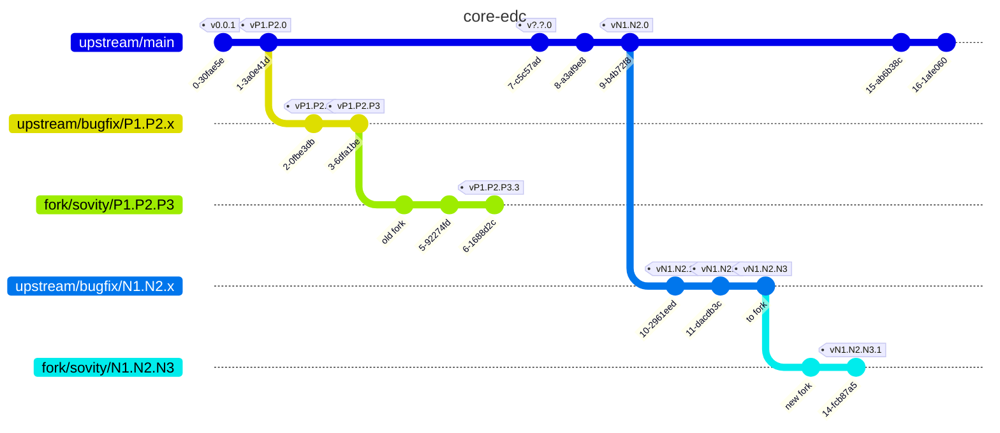
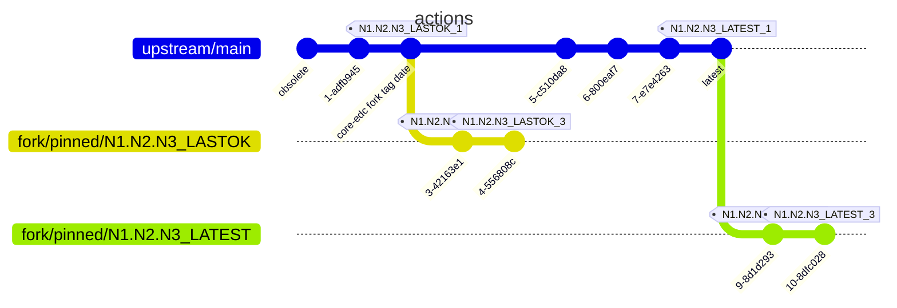

# New Fork

This procedure details how to fork a new version of the core EDC and migrate the changes of the previous version to that new version.

This procedure was updated for the last time for the **0.7.2** fork.
Keep in mind that any new EDC version comes with novelties and that this procedure may need adjustments.

## Work Breakdown

As a general rule, look at the early diffs of the previous forks to see what was added of removed.

In this procedure, we will work with the following repositories

| part ⬇ source ➡ | Eclipse EDC (upstream)                       | sovity (fork)                             |
|-----------------|----------------------------------------------|-------------------------------------------|
| core-edc        | https://github.com/eclipse-edc/Connector     | https://github.com/sovity/core-edc        |
| actions         | https://github.com/eclipse-edc/.github       | https://github.com/sovity/core-edc-github |
| gradle plugin   | https://github.com/eclipse-edc/GradlePlugins |                                           |

### Steps

- [Make it work locally](#make-it-work-locally)
- [Make it work in the CI](#make-it-work-in-the-ci)

### Bonus

Helpful git commands.

#### Find the common ancestor

For instance to know from which commit on the main branch a pinned version comes from.

`git merge-base A B` finds the last common commit between the references `A` and `B`.

e.g. `git merge-base A.B.C-2025.06.07-3 main` -> `tag date`

#### Show a colored simplified graph

This will hide all the intermediate commits and show only the one that are key to understand the repo's tree structure: tags, branches with author, date, hash.

`git log --graph --simplify-by-decoration --abbrev-commit --decorate --format=format:'%C(bold blue)%h%C(reset) - %C(bold green)(%ar)%C(reset) %C(white)%s%C(reset) %C(dim white)- %an%C(reset)%C(bold yellow)%d%C(reset)' --all`

#### Interactive git

https://jonas.github.io/tig/

## Configuration

This procedure uses templates for the version.
It is advised to replace all the template strings with the version that you want to migrate for more clarity

- [ ] Identify the versions that you migrate
- `NEXT` is the `upstream` version that you want to fork from. e.g **0.7.2**
    - `N1` is `0`
    - `N2` is `7`
    - `N3` is `2`
- `PREVIOUS` is the version that you will copy the fork changes from. e.g. **0.2.1.4**
    - `P1` is `0`
    - `P2` is `2`
    - `P3` is `1`
    - `P4` is `4`

# Let's fork!

## Set up

Each version that needs forking has its own branch in the sovity fork.

Here we have an old fork that we want to get the features from named `vP1.P2.P3.x` and a new fork named `vN1.N2.N3.x` into which we want to port the changes made in `vP1.P2.P3.x` up to `vP1.P2.P3.3`

Note: the branch names here are to be seen as references, so they should really be `remotes/...`.



## Make it work locally

This section describes the steps to prepare the fork and make it run locally.

### Setup a repository

- [ ] Clone the `fork` `core-edc`
    - `git clone --origin fork git@github.com:sovity/core-edc.git`
- [ ] Add the upstream repository
    - `git remote add upstream git@github.com:eclipse-edc/Connector.git`
- [ ] Fetch the upstream tags
    - `git fetch --all --tags`

### Setup example

Your repository now looks like this:

`git remote -v`

```
fork	git@github.com:sovity/core-edc.git (fetch)
fork	git@github.com:sovity/core-edc.git (push)
upstream	git@github.com:eclipse-edc/Connector.git (fetch)
upstream	git@github.com:eclipse-edc/Connector.git (push)
```

`git branch -a`

```
remotes/fork/default          # the replacement for upstream/main use in the sovity fork
remotes/fork/main             # not used in the fork, deplaced by main
remotes/fork/sovity/O12.O3     # the previous fork branch
remotes/upstream/bugfix/N1.N2.N3 # the branch we want to work
...                           # and many other branches
```

`git tag -l`

The output will vary based on the version that have already been forked. Here is the output where `0.2.1` exists and `0.7.2` will be forked.

```
v0.2.1    # the upstream previously forked version
v0.2.1.2  # v0.2.1.1 is missing because it was never published correctly and was replaced by 0.2.1.2
v0.2.1.3
v0.2.1.4  # the latest sovity fork version of v0.2.1
v0.7.2    # the version we want to fork
...
```

### Establish the branches

- [ ] In the fork, find the tag `vN1.N2.N3` of the branch that you want to fork from.
- [ ] Create a new branch `sovity/N1.N2.N3` from that tag.
    - `git checkout -b sovity/N1.N2.N3 vN1.N2.N3`
- [ ] Push this branch to the fork. It will be our new `main` for this fork version.
    - `git push fork sovity/N1.N2.N3:sovity/N1.N2.N3`
- [ ] Checkout a new branch `N1.N2.N3-fork-setup` on the same commit as `sovity/N1.N2.N3.x`.
    - `git checkout sovity/N1.N2.N3`
    - `git checkout -b N1.N2.N3-fork-setup`
- [ ] In `gradle.properties`, set the correct branch version: `N1.N2.N3.1`.

`git remote show fork`

The output will vary.

```
* remote fork
  Fetch URL: git@github.com:sovity/core-edc.git
  Push  URL: git@github.com:sovity/core-edc.git
  HEAD branch: doesntMatter
  Remote branches:
    sovity/0.2.1           tracked
    sovity/0.7.2           tracked
    ... more
  Local branches configured for 'git pull':
    sovity/0.7.2 merges with remote sovity/0.7.2
    ... more
  Local refs configured for 'git push':
    sovity/0.7.2 pushes to sovity/0.7.2 (up to date)
    ... more
```

### Update the project

- [ ] Before editing the code, check that your IDE has the correct editor settings (imports single classes, indents, ...). There is an `editorconfig` file in the project.
- [ ] Run the tests locally and check that they all work. If not:
    - [ ] Try to fix the test if it's relevant for the changes that we want to do in the fork.
    - [ ] Consider adding `@Disabled` on the tests that we will likely not use or that would be hard to fix.
    - e.g. outdated certificates would be hard to regenerate and fix and could be disabled as long as our fork doesn't touch the parts of the code that use them.
- [ ] Add a changelog `CHANGELOG.md` and the docs `docs/developer/fork/*` from the previous version `P1.P2.P3.P4`
    - `git checkout P1.P2.P3.P4 -- CHANGELOG.md docs/developer/fork/\*`
    - [ ] Remove the previous releases from the `CHANGELOG.md` and keep the template.
    - [ ] Add a new doc file `docs/developer/fork/vN1.N2.N3.X.md`
- [ ] For each of the former change in the `CHANGELOG.md`
    - [ ] Evaluate whether the change needs to be ported
        - Reasons for not porting may include
            - The code that the fork used no longer exist
            - The change or an equivalent was implemented upstream in a version before or including `N1.N2.N3`.
            - The change is no longer desired
            - ...
    - [ ] Port the change if needed
        - You may try to `git cherry-pick` the changes from the previous fork one by one and resolve conflicts.
        - You may try a diff+apply+merge between the commits of the previous fork may be enough to port the change
            - `git apply <(git diff vP1.P2... vP1.P2...)`
    - [ ] Document the change in the `CHANGELOG.md`.
    - [ ] Detail the change in the current documentation `docs/developer/fork/vN1.N2.N3.X.md`. Check out the previous fork documentation for how to structure the document.
- [ ] Implement the new changes that apply to this fork.

## Make it work in the CI

### Find the correct GitHub action.

The EDC, as of `0.7.x`, uses actions that are located in a separate repository. That repository [is forked](https://github.com/sovity/core-edc-github).

Because the EDC used the `@main` version in its CI, it is certain that the scripts that are the current `@main` ones were not the ones that were originally used for the Eclipse EDC release you're forking, and it is likely that the current scripts will fail, be renamed, have a different behaviour, ...

In a best-effort attempt to restore the CI, we need to pin the versions that were used and maybe update them to work on the current GitHub.

If we pin down the old version, a lot of updates may be needed.

If we pin down the new version, scripts may be missing.

The strategy here is to pin down the latest from main and fix the missing scripts individually and later update them.

## Set up a repository

- [ ] Clone the `fork` `actions` repository
    - `git clone --origin fork git@github.com:sovity/core-edc-github.git`
- [ ] Add the `upstream` `actions` repository
    - `git remote add upstream git@github.com:eclipse-edc/.github.git`
- [ ] Update
    - `git fetch --all --tags`

### Result

`git remote -v`

```
fork	git@github.com:sovity/core-edc-github.git (fetch)
fork	git@github.com:sovity/core-edc-github.git (push)
upstream	git@github.com:eclipse-edc/.github.git (fetch)
upstream	git@github.com:eclipse-edc/.github.git (push)
```

### Overview

Here is the example forking scenario.

`LATEST` and `LASTOK` are iso dates `YYYY-MM-DD`



The naming scheme for the tagged and updated actions is `fork version` + `date at which the action was working` + `-version`

e.g. `N1.N2.N3_2025-06-07_1` for the latest main commit.
e.g. `N1.N2.N3_2022.03.04_7` for the commit that was used during releasing, 7th revision. You will need potentially many revisions as you will need to push the tag each time you make a change to let the CI use that version, then retry if it failed.

This was tested to work quite well in version **0.7.2** and is detail below.

For the cases that can't be covered with the best effort approach, a fork strategy is detailed below,
see [Lost action](#lost-action)

If you need more than 1 branch for a single date, be creative in the name, either use DATE+TIME or DATE+suffix. In any case, that scenario is unlikely to happen.

#### Finding LATEST and LASTOK

`LATEST` is the last commit on the `main` `upstream` branch.

- [ ] You may replace `LATEST` by the date you found. The date part should be enough.
- `git show --no-patch --format=%ci upstream/main`

`LASTOK` is optional and will be defined later.

### Pin the action versions

- Pin the latest version
    - [ ] Create a branch to track the latest `LATEST` `main` from `upstream`
        - `git checkout upstream/main`
        - `git checkout -b pinned/N1.N2.N3_LATEST`
    - [ ] Push the branch to the fork
        - `git push fork`
    - [ ] Tag the latest commit in the action set with the label `core edc fork branch` - `today` - `1` (e.g `N1.N2.N3-LATEST-1`)
        - `git tag N1.N2.N3_LATEST_1 pinned/N1.N2.N3_LATEST`
    - [ ] Push that new tag to the sovity core edc github fork
        - `git push fork tag N1.N2.N3_LATEST_1`
    - [ ] Change all the action's `@main` version for the `N1.N2.N3_LATEST_1` version
    - [ ] Change all the `eclipse-edc/.github` for `sovity/core-edc-github`
        - ❌ `eclipse-edc/.github/.github/workflows/task.yml@main`
        - ✔ `sovity/core-edc-github/.github/workflows/task.yml@N1.N2.N3_LATEST_1`
        - [ ] IDE: replace `eclipse-edc/.github/(.*)@main` with `sovity/core-edc-github/$1@N1.N2.N3_LATEST_1`
    - Run the CI via a PR and check for errors

From here we have:
- An action works -> done
- An action doesn't work
    - Is the action useless? -> remove it
        - [ ] Discord webhook
        - [ ] First interaction
        - [ ] Others...
        - [ ] Disable failing tests that don't matter
            - [ ] failing because of outdated certificates
    - An action has an obsolete dependency / needs adjustments -> see [Adjust the pinned main](#adjust-the-pinned-main)
    - An action is missing: we need to find it in the history -> see [Lost action](#lost-action)
    - Something else that was not encountered yet: be creative and update this guide after you found the solution.

### Adjust the pinned main

- Update the code in the `pinned/N1.N2.N3-LATEST` branch
- Commit and tag your new version as `N1.N2.N3_LATEST_(N+1)` in the `actions` repo
- Push the tag to the sovity fork repo
- Update all the `@N1.N2.N3_LATEST_N` to `N1.N2.N3_LATSET_(N+1)`
- Repeat until fixed

### Lost action

This part describes how to find where a missing action was and how to make it work again.

- [ ] Identify the date `LASTOK` when the `core-edc` version was released either with:
  - [ ] Alternative 1: locate the file in the git history.
      - `git log --oneline --follow -- '.github/actions/THEACTIONNAME'`
  - [ ] Alternative 2: Use the tag date.
    - `git show --no-patch --format=%ci vN1.N2.N3` in the `core-edc` repo. e.g `2022-03-04`
    - Note: the time may be important. By specifying only the date, we will get all the commit of that day until midnight.
- [ ] Find in the `fork` `action` repository the *commit* on the main branch that happened right before the time
  the tagged commit in the core EDC was created.
    - `git log --date=iso -n 2 --before="LASTOK"`
    - e.g. `git log --date=iso -n 2 --before="2022-03-04"`
    - Note: the time may be important, increase the value of `LINES` to show more than 1 line.
- [ ] Create a new branch `pinned/P1.P2.P3_LASTOK` from this older commit
- [ ] Push this branch to the fork
- [ ] Tag this new version as `P1.P2.P3_YYYY.MM.DD_1` e.g. `P1.P2.P2_2022-03-04_1`
- [ ] Push this tag to the `actions` fork
    - e.g. `git push fork tag P1.P2.P3_LASTOK_1`
- [ ] Change the missing dependency versions in the `core-edc` `fork` from the pinned latest to that new version.
- [ ] Run in the CI and go to [adjusting](#adjust-the-pinned-main) if needs be, but this time using this new branch.

## Publishing

- [ ] Steal the publishing and promoting tasks from a previous fork
    - `0.7.2.x`: publishing and promoting
        - `git checkout sovity/0.7.2 -- .github/workflows/verify.yml build.gradle.kts`
    - `0.2.1.x`: publishing
        - `git checkout sovity/0.2.1 -- .github/workflows/publish.yml build.gradle.kts`
- [ ] Adapt the publishing and promoting actions to the new `core-edc`'s actions.
  - [ ] Branches starting with `sovity/` must be published on the `AzureTest` instance.
  - [ ] Tags starting with `v` must be published on the `Azure` (non test) instance.
- [ ] Disable the jar signing
    - `v0.2.1` / `v0.7.2`
        - The signing is managed in the EDC gradle plugin.
        - [ ] Add `skip.signing=true` to the `gradle.properties`
- [ ] Test the publishing on the Azure Test instance, by publishing a branch starting by `sovity/`.
    - [ ] Create a PR with some changes to target the `core-edc` fork on a `sovity/` branch and merge it.
    - [ ] Check that the artifacts have been deployed to the [Azure Test repo](https://dev.azure.com/sovity/Test/_artifacts/feed/test)
- [ ] Update the `release.md` on the default branch.
- [ ] This should also be working for the prod release, but adjustments may be needed.
  - [ ] Start a release, in this project's.

TODO: extract the publishing task to the `actions` repo.

### Finalization

- [ ] Update this procedure with new hints after forking an EDC version.

TODO: use stars to quote existing versions to avoid confusion with templates