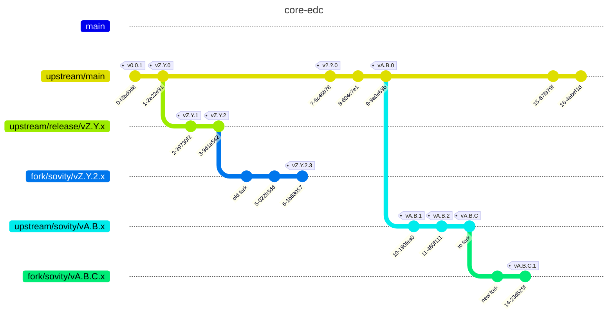
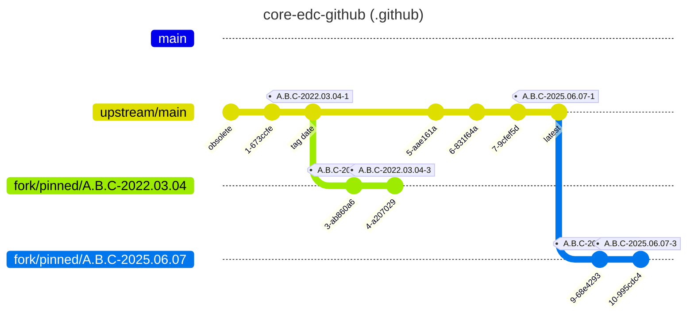

# New Fork

This procedure was updated for the last time for the `0.7.2` fork.

## Work Breakdown

As a general rule, look at the early diffs of the previous forks to see what was added of removed.

As of `0.7.x`, there are 2 required repositories:

- The [core EDC](https://github.com/sovity/core-edc) later referred to as the `core-edc` repository.
- The [core EDC .github actions](https://github.com/sovity/core-edc-github) later referred to as the `actions` repository.

And another repository that will be of interest:

- The [EDC Gradle plugin](https://github.com/eclipse-edc/GradlePlugins)

### Steps

- [Make it work locally](#make-it-work-locally)
- [Make it work in the CI](#make-it-work-in-the-ci)

### Bonus

Helpful git commands.

#### Find the common ancestor

For instance to know from which commit on the main branch a pinned version comes from.

`git merge-base A B` finds the last common commit between the references `A` and `B`.

e.g. `git merge-base A.B.C-2025.06.07-3 main` -> `tag date`

# Let's fork!

## Setup

This is the setup used as an example for the core EDC repository and its fork.

`upstream/` -> the core EDC's branches
`fork/` -> the fork's branches

Each version that needs forking has its own branch in the sovity fork.

Here we have an old fork that we will assume we want to get the features from named `vZ.Y.2.x` and a new fork named `vA.B.C.x` into which we want to port the changes made in `vZ.Y.2.x` up to `vZ.Y.2.3`

### Make it work locally

This section describes the steps to prepare the fork and make it run locally.

- [ ] Checkout the sovity core EDC fork
- [ ] Add the upstream repository
    - `git remote add upstream git@github.com:eclipse-edc/Connector.git`
- [ ] Fetch the upstream tags
    - `git fetch upstream --tags`
- [ ] In the fork, find the tag `vA.B.C` of the branch that you want to fork from
- [ ] Create a new branch `sovity/A.B.C.x` from that commit.
- [ ] Checkout a new branch `A.B.C-fork-setup` on the same commit as `sovity/A.B.C.x`.
- [ ] In `gradle.properties`, set the correct branch version: `A.B.C.1`.
- [ ] Before editing the code, check that your IDE has the correct editor settings (imports single classes,
  indents, ...). There is an `editorconfig` file in the project.
- [ ] Run the tests locally and check that they all work. If not:
    - [ ] Try to fix the test if it's relevant for the changes that we want to do in the fork.
    - [ ] Consider adding `@Disabled` on the tests that we will likely not use or that would be hard to fix.
    - e.g. outdated certificates would be hard to regenerate and fix and could be disabled as long as our fork doesn't       touch the parts of the code that use them.
- [ ] Add a changelog based on the previous version.
    - [ ] Checkout the old version
        - `git checkout vZ.Y.2.3 -- CHANGELOG.md`
- [ ] Copy the docs from the previous fork into this one
    - [ ] from version `vZ.Y.2.3` `docs/developer/fork/*` into `vA.B.C.x` `docs/developer/fork/*`
    - [ ] add a new file `docs/developer/fork/vA.B.C.X.md`
- [ ] For each of the former change in the `CHANGELOG.md`
    - [ ] Evaluate whether the change needs to be ported
        - Reasons for not porting may include
            - The code that the fork used no longer exist
            - The change or an equivalent was implemented upstream in a version before or including `A.B.C`.
            - The change is no longer desired
            - ...
    - [ ] Port the change if needed
        - A diff+apply+merge between the commits of the previous fork may be enough to port the change
            - `git apply <(git diff vZ.Y... vZ.Y...)`
    - [ ] Document the change in the `CHANGELOG.md`
    - [ ] Detail the change in the current documentation `docs/developer/fork/vA.B.C.X.md`
- [ ] Implement the new changes that apply to this fork.

### Make it work in the CI

#### Find the correct GitHub action.

The EDC, as of `0.7.x`, uses actions that are located in a separate repository. That repository [is forked](https://github.com/sovity/core-edc-github).

Because the EDC used the `@main` version, it is certain that the scripts that are the current ones were not the ones that were originally used for the Eclipse EDC release months ago, and it is likely that the current scripts will fail.

In a best-effort attempt to restore the CI, we need to pin the versions that were used and maybe update them to work on the current GitHub.

If we pinf down the old version, a lot of update will be needed.

If we pin down the new version, scripts may be missing.

The strategy here is to pin down the latest from main and fix the individual missing scripts and later update their dependencies as needed.

#### Overview

Here is the example forking scenario.

with

- the sovity fork labelled as `fork` in the `git remote -v` output
- the EDC upstream labelled as `upstream` in the `git remote -v` output

- today = `2025-06-07`
- Last time the actions were present = `2022.03.04`

The naming scheme for the tagged and updated actions is `fork version` + `date at which the action was working` + `-version`

e.g. `A.B.C-2025-06-07-1` for the latest main commit.
e.g. `A.B.C-2022.03.04-7` for the commit that was used during releasing, 7th revision. You will need potentially many  revisions as you will need to push the tag each time you make a change to let the CI use that version, then retry if it failed.

This procedure attempts a best effort approach and tries to use the latest set of actions. That way there is no need to also fork the old actions and update them.

This was tested to work quite well in `0.7.2` and is detail below.

For the cases that can't be covered with the best effort approach, a fork strategy is detailed below,
see [Lost action](#lost-action)

#### Pin the action versions

- Pin the latest version
    - [ ] Check that the upstream is present
        - `git remote -v` should show the repos, among which 
          - the `fork` probably named `origin` (`git@github.com:sovity/core-edc-github.git`)
          - the `upstream` (`git@github.com:eclipse-edc/.github.git`)
        - [ ] Add the upstream if not present
            - `git remote add upstream git@github.com:eclipse-edc/.github.git`
    - [ ] Update the local copy with the fork and the upstream
        - `git fetch --all --tags`
    - [ ] Create a branch to track the latest main from upstream
        - `git checkout -b pinned/A.B.C-2025-06-07 upstream/main`
    - [ ] Tag the latest commit in the action set as `core edc fork branch` - `today` - `1` (e.g `A.B.C-2025.06.07-1`)
        - `git tag A.B.C-2025.06.07-1 pinned/A.B.C-2025.06.07`
    - [ ] Push that new tag to the sovity core edc github fork
        - `git push origin tag A.B.C-2025.06.07-1`
    - [ ] Change all the action's `@main` version for the `A.B.C-2025.06.07-1` version
    - [ ] Change all the `eclipse-edc/.github` for `sovity/core-edc-github`
        - ❌ `eclipse-edc/.github/.github/workflows/task.yml@main`
        - ✔ `sovity/core-edc-github/.github/workflows/task.yml@A.B.C-2025.06.07-1`
    - Run the CI via a PR and check for errors

From here we have:

- [ ] Run the tests in CI and disable any failed action that we don't need:

- An action works -> done
- An action doesn't work
  - Is the action useless? -> remove it
    - [ ] Discord webhook
    - [ ] First interaction
    - [ ] Others...
    - [ ] Disable failing tests that don't matter
      - [ ] failing because of outdated certificates
  - An action has an obsolete dependency / needs adjustments -> see [Adjust the pinned main](#adjust-the-pinned-main)
  - An action is missing: we need to find it in the history -> see [Lost action](#lost-action)
  - Something else that was not encountered yet: be creative and update this guide after you found the solution.

#### Adjust the pinned main

- Update the code in the `A.B.C-2025.06.07` branch
- Commit and tag your new version as `A.B.C-2025.06.07-(N+1)` in the `actions` repo
- Push the tag to the sovity fork repo
  - `git push `
- Update all the `@A.B.C-2025.06.07-N` to `A.B.C-2025.06.07-(N+1)`
- Repeat until fixed

#### Lost action

This part describes how to find where a missing action was and how to make it work again.

- [ ] Identify the date when the version was released:
    - `git show --date=iso vA.B.C` in the core EDC repo. e.g `2022-03-04`
    - Note: the time may be important. By specifying only the date, we will get all the commit of that day until midnight.
- [ ] Find in the `sovity/core-edc-github` repository the commit on the main branch that happened right before the time
  the tagged commit in the core EDC was created.
    - `git log --date=iso -n LINES --before="YYYY-MM-DD"`
    - e.g. `git log --date=iso -n 1 --before="2022-03-04"`
    - Note: the time may be important, increase the value of `LINES` to show more than 1 line.
- [ ] Create a new branch `pinned/Z.Y.2-2022.03.04` from this older commit
- [ ] Tag this new version as `Z.Y.2-YYYY.MM.DD-1` e.g. `Z.Y.2-2022-03-04-1`
- [ ] Push this tag to the `actions` fork
  - e.g. `git push fork tag Z.Y.2-2022-03-04-1`
- [ ] Change the missing dependency versions in the `core-edc` from the pinned latest on main (e.g. `A.B.C-2025.06.07-1`) to that new version.
- [ ] Run in the CI and go to [adjusting](#adjust-the-pinned-main) if needs be, but this time using this new branch.

### Publishing

- [ ] Steal the publishing and promoting tasks from a previous fork
  - `0.7.2.x`: publishing and promoting
    - `git checkout sovity/0.7.2 -- .github/workflows/verify.yml`
  - `0.2.1.x`: publishing
    - `git checkout sovity/0.2.1 -- .github/workflows/publish.yml`
- [ ] Adapt the actions to the new `core-edc`'s actions.
- Test the publishing on the Azure Test instance, by publishing a branch starting by `sovity/`.
  - [ ] Create a PR with some changes to target the `core-edc` fork on a `sovity/` branch and merge it.
  - [ ] Check that the artifacts have been deployed to the [Azure Test repo](https://dev.azure.com/sovity/Test/_artifacts/feed/test)
  - 

### Finalization

- [ ] Update this procedure with new hints after forking an EDC version.
